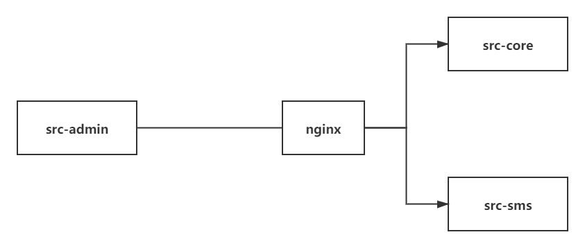

# srb项目

# [B站尚硅谷官方学习视频链接](https://www.bilibili.com/video/BV1VV411n7nR?spm_id_from=333.999.0.0)

# 架构图

- **技术架构****

  

  

- **业务结构**


# 前端系统

## 前端框架

| 技术              | 说明                                                         | 官网                                             |
| ----------------- | ------------------------------------------------------------ | ------------------------------------------------ |
| vue-element-admin | 基于Vue.js的后台管理系统UI集成（后台后端框架）               | https://github.com/PanJiaChen/vue-admin-template |
| NuxtJS            | 基于Vue.js构建的服务器端渲染应用的轻量级框架（前台前端框架） | https://nuxtjs.org                               |

## 运行前端

```bash
安装Node.js
# 安装依赖
npm install

# 启动 浏览器自动弹出并访问http://localhost:9528/
npm run dev
```

- 了解前端系统流程 

  1. 定义路由映射组件 ```component```

  2. 定义api模块 ```return request```（请求后端服务方法）

  3. 定义页面组件模板 ```<template>```

  4. 定义页面组件脚本 ```<script>```（调用api模块方法，获得后端数据渲染到模板）

     

# nginx反向代理

- 解决前端程序能够同时对接多个后端服务问题
- 解决方案有nginx反向代理、微服务网关等



- nginx的配置nginx.conf

  ```bash
  server {
      listen       80;
      server_name  localhost;
      location ~ /core/ {           
          proxy_pass http://localhost:8110;
          proxy_set_header X-Forwarded-For $proxy_add_x_forwarded_for;
      }
      location ~ /sms/ {           
          proxy_pass http://localhost:8120;
          proxy_set_header X-Forwarded-For $proxy_add_x_forwarded_for;
      }
      location ~ /oss/ {           
              proxy_pass http://localhost:8130;
              proxy_set_header X-Forwarded-For $proxy_add_x_forwarded_for;
      }
  }
  ```

  

# 后端系统


## 组织结构

```
srb 
|__ commom -- 通用工具类模块
|__ service-base -- 业务层数据库相关代码
|__ service-core -- 核心业务服务
|__ service-oss -- 对象存储服务
|__ service-sms -- 短信服务服务
```


## 技术栈

**1、后端**

| 技术                              | 说明                   | 官网                                            |
| --------------------------------- | ---------------------- | ----------------------------------------------- |
| SpringBoot 2.3.4.RELEASE          | 快速创建一个服务       | <https://spring.io/projects/spring-boot>        |
| SpringCloud Hoxton.SR8            | 微服务治理             | https://spring.io/projects/spring-cloud         |
| SpringCloud Alibaba 2.2.2.RELEASE | 微服务治理             | https://spring.io/projects/spring-cloud-alibaba |
| Mybatis-Plus                      | 持久层框架和代码生成器 | https://baomidou.com/                           |
| Lombok                            | 简单实体类开发         | https://github.com/projectlombok/lombok         |
| Swagger2                          | 文档生成工具           | https://github.com/swagger-api/swagger-ui       |
| Logback                           | 日志系统               | http://logback.qos.ch/                          |
| alibaba-easyexcel                 | Excel表单的读写        | https://github.com/alibaba/easyexcel            |
| JWT                               | JWT单点登陆            | https://github.com/jwtk/jjwt                    |
| Spring Data Redis                 | 缓冲层框架             | https://spring.io/projects/spring-data-redis    |
| Spring Task                       | 定时任务               |                                                 |


**2、数据库和中间件**

| 技术         | 说明         | 官网                      |
| ------------ | ------------ | ------------------------- |
| MySQL 5.7    | 关系型数据库 | https://www.mysql.com/    |
| Redis 5.0    | 缓存技术     | https://redis.io/         |
| RabbitMQ 3.8 | 消息中间件   | https://www.rabbitmq.com/ |


**3、三方接口**

| 技术      | 说明            | 官网                    |
| --------- | --------------- | ----------------------- |
| 阿里云SMS | 发送短信接口    | https://www.aliyun.com/ |
| 阿里云OSS | 分布式文件存储  | https://www.aliyun.com/ |
| 汇付宝    | 资金托管平台API |                         |