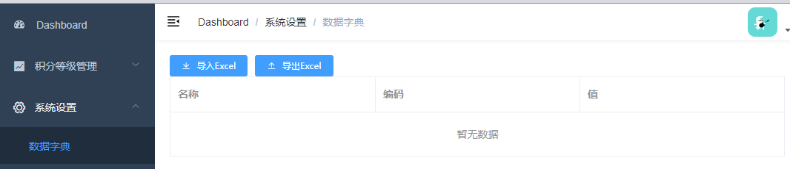
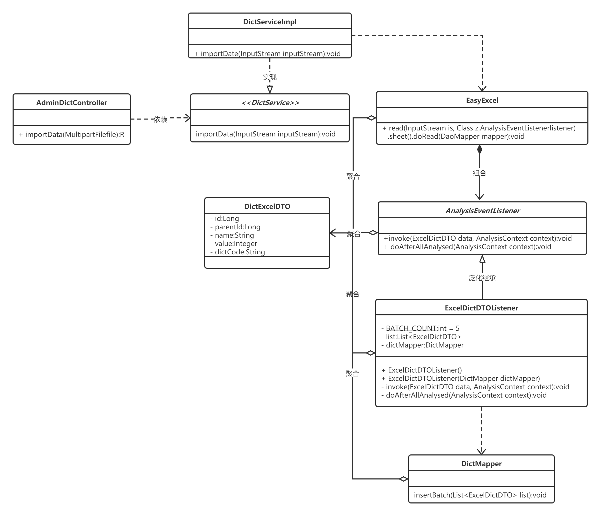

# srb项目


# 后台系统

## 后台前端

- [**vue-admin-template**](https://github.com/PanJiaChen/vue-admin-template)(后台管理系统基础模板)

- 启动后台前端系统

  ```bash
  # 安装依赖
  npm install
  
  # 启动 浏览器自动弹出并访问http://localhost:9528/
  npm run dev
  ```

- 了解前端系统流程 

  1. 定义路由映射组件 ```component```

  2. 定义api模块 ```return request```（请求后端服务方法）

  3. 定义页面组件模板 ```<template>```

  4. 定义页面组件脚本 ```<script>```（调用api模块方法，获得后端数据渲染到模板）

     

### nginx反向代理

- 解决前端程序能够同时对接多个后端服务问题
- 解决方案有nginx反向代理、微服务网关等


- nginx的配置nginx.conf

  ```bash
  server {
      listen       80;
      server_name  localhost;
      location ~ /core/ {           
          proxy_pass http://localhost:8110;
      }
      location ~ /sms/ {           
          proxy_pass http://localhost:8120;
      }
      location ~ /oss/ {           
              proxy_pass http://localhost:8130;
      }
  }
  ```

  

## 后台后端

### 数据字典



- 借助 [EasyExcel](https://github.com/alibaba/easyexcel) 完成数据字典的excel的导入功能

  ```java
  <dependency>
      <groupId>com.alibaba</groupId>
      <artifactId>easyexcel</artifactId>
  </dependency>
  <dependency>
      <groupId>org.apache.xmlbeans</groupId>
      <artifactId>xmlbeans</artifactId>
  </dependency>
  ```

- UML类图

  


## 集成Redis

- RedisTemplate 需要 ==序列化== 传输的数据
- 用Redis缓存数据字典提高性能（数据字典常用数据，且数据变化性小）


## 调用阿里云SMS（短信服务）

